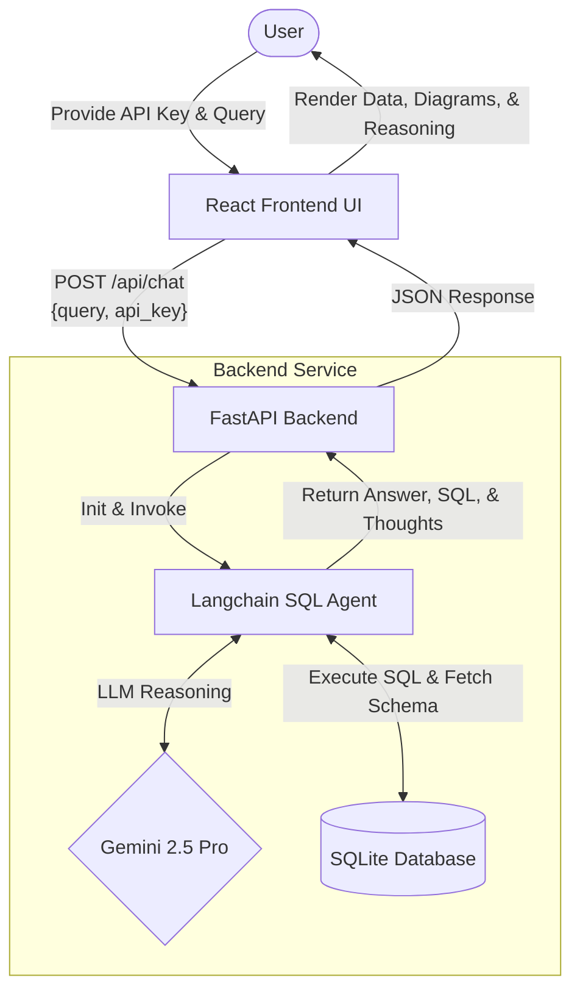

# Agentic-AI-Driven-Chat-with-SQL-Database
🚀 This Text-to-SQL App lets you easily analyze complex relational data by asking questions in plain English. Powered by Google's Gemini 2.5 Pro, an AI agent creates and runs SQL queries, returning precise natural language answers, raw SQL, execution metrics, and an interactive ER Diagram of the data.

## Architecture
This project uses a modern decoupled architecture:
- **Backend**: FastAPI (Python) powers the API, serving the Langchain Agent and parsing database metadata.
- **Frontend**: A React (Vite) web app features a premium light-themed UI built with Vanilla CSS and interactive Data outputs.



## Prerequisites
To run this repository locally, you need:
- Python 3.9+
- Node.js (v18+)
- Google Gemini API key

## Setup Instructions

### 1. Backend (Python/FastAPI)
First, initialize your environment and boot the background API server.
```bash
# Clone the repository
git clone https://github.com/AnandThirwani8/Agentic-AI-Driven-Chat-with-SQL-Database.git
cd Agentic-AI-Driven-Chat-with-SQL-Database

# Create and activate a virtual environment (macOS/Linux)
python3 -m venv venv
source venv/bin/activate
# Windows: venv\Scripts\activate

# Install dependencies
pip install -r requirements.txt
pip install fastapi uvicorn

# Build the SQLite Database (company_data.db) from provided Excel files
python init_db.py

# Start the FastAPI backend server on port 8000
uvicorn api:app --reload
```

### 2. Frontend (Node.js/React)
In a new terminal window, start the interactive User Interface.
```bash
# From the root directory, move into the frontend folder
cd frontend

# Install node dependencies
npm install

# Start the React development server
npm run dev
```

### 3. Usage
1. Open your browser and navigate to the local URL provided by Vite (usually `http://localhost:5173`).
2. Enter your Google Gemini API Key in the settings or sidebar.
3. Start querying your SQL Database!
